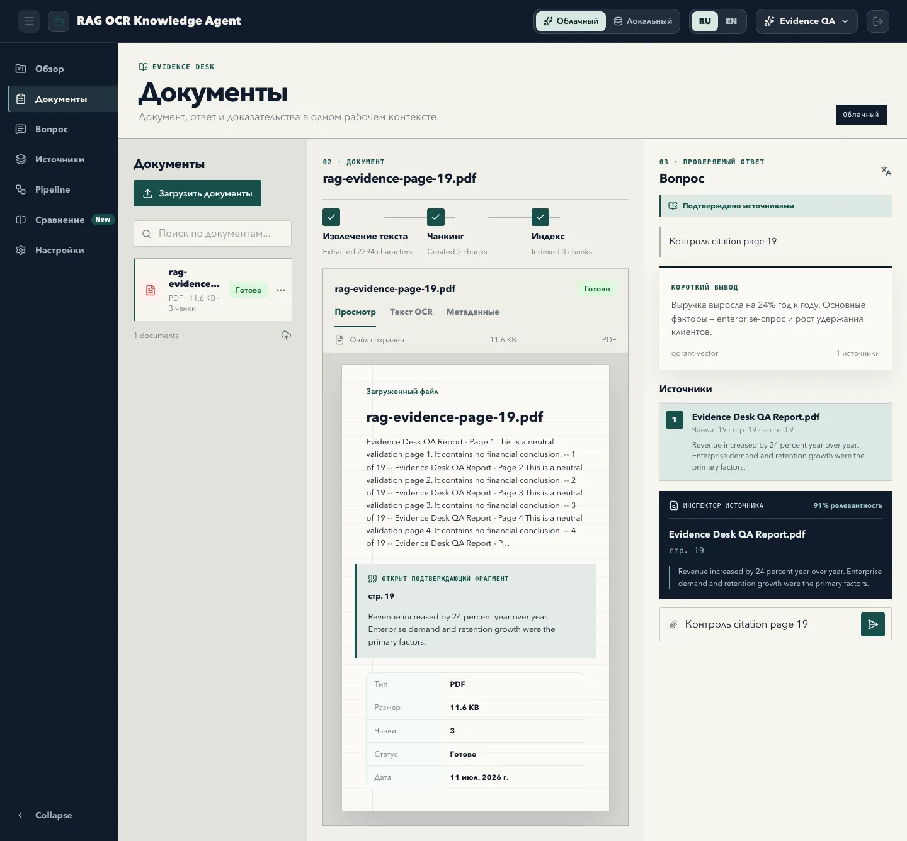
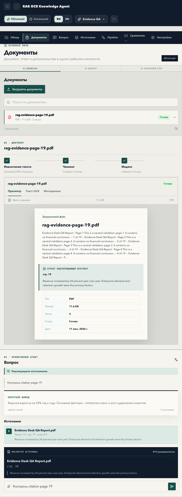
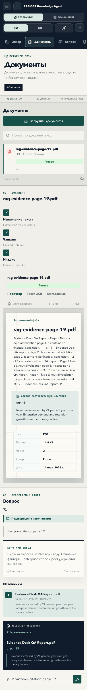

# RAG OCR Knowledge Agent — Evidence Desk

**Evidence-first рабочее место для ответов по корпоративным документам.** Пользователь видит не только вывод AI, но и документ, страницу, чанк и точный подтверждающий фрагмент рядом с ответом.

[Открыть live demo](https://rag-ocr.ivantereshin-test.store/) · [Архитектура](ARCHITECTURE.md) · [Production roadmap](PRODUCTION_ROADMAP.md)



## Зачем этот продукт

Обычный корпоративный чат скрывает путь от вопроса до ответа. Это опасно: уверенный текст может не иметь опоры в документах. Evidence Desk делает доказательство частью основного интерфейса.

Пользователь проходит один прозрачный сценарий:

1. **Библиотека** — загружает PDF, DOCX, PPTX, XLSX, TXT, CSV или изображение.
2. **Документ** — видит этапы извлечения текста, чанкинга и индексации.
3. **Проверяемый ответ** — получает вывод с источником, номером страницы и фрагментом, который можно сопоставить с документом.

Это не просто UI-концепт: demo использует реальную регистрацию, загрузку, обработку документов, retrieval и API ответа.

## Что реализовано в P0

- адаптивный Evidence Desk: три панели на desktop, две колонки на tablet, линейный сценарий `01 → 02 → 03` на mobile;
- статусы документа: `uploaded`, `queued`, `processing`, `ready`, `failed`;
- состояния доказательности: подтверждено источниками, низкая уверенность, нет доказательств, частичный сбой;
- связка ответа с документом, страницей, чанком, score и фрагментом;
- локальный retrieval и адаптеры для Qdrant, TEI и облачных reranker-провайдеров;
- cloud/local профили через одну архитектуру адаптеров;
- cookie-сессии и CSRF-защита state-changing запросов;
- безопасная загрузка с лимитами, проверкой типа и опциональным ClamAV;
- PostgreSQL или локальный JSON store; Redis worker и S3/MinIO для production-профиля;
- accessibility-база: клавиатурная навигация, именованные controls, reduced motion, контрастные состояния.

## Архитектура

```text
Browser
  │  HttpOnly session cookie + CSRF header
  ▼
Fastify API
  ├─ Auth / settings / documents / ask
  ├─ Ingestion: validate → parse/OCR → chunk → index
  ├─ Retrieval: local or Qdrant → reranker → citations
  └─ Answer generation: template fallback / OpenAI / local compatible API
       │
       ├─ PostgreSQL or JSON store
       ├─ S3 / MinIO source storage
       ├─ Redis worker
       ├─ Qdrant vector index
       └─ TEI local reranker
```

Ключевой принцип: бизнес-логика общая, технологии подключаются адаптерами. Облачный и локальный режимы не расходятся в две независимые кодовые базы.

Подробнее: [ARCHITECTURE.md](ARCHITECTURE.md).

## Стек

| Слой | Технологии |
|---|---|
| Frontend | React, TypeScript, Vite, CSS |
| API | Fastify, TypeScript |
| Parsing | PDF Parse, Mammoth, JSZip, read-excel-file |
| Storage | PostgreSQL или JSON, S3/MinIO |
| Queue | Redis worker |
| Retrieval | Local search, Qdrant |
| Reranking | TEI/BGE, Cohere, Voyage, Jina |
| Generation | OpenAI Responses API или OpenAI-compatible local LLM |
| Security | HttpOnly/Secure/SameSite cookie, CSRF, CSP, rate limits, upload validation |

## Скриншоты

| Tablet | Mobile |
|---|---|
|  |  |

PNG-оригинал desktop-кадра: [docs/screenshots/evidence-desk-desktop.png](docs/screenshots/evidence-desk-desktop.png).

## Локальная проверка без Docker

Требуется Node.js 22+.

```bash
npm ci --prefix apps/web
npm ci --prefix apps/api
npm run lint
npm run test:csrf:web
npm run test:csrf
npm run build
```

Для запуска собранного приложения с локальным JSON store:

```bash
export APP_SECRET="$(openssl rand -hex 32)"
export DATA_DIR="$(pwd)/.local-data"
export PROCESSING_MODE=inline
export SESSION_COOKIE_SECURE=false

npm run build
npm --prefix apps/api start
```

Откройте `http://localhost:3000`. Не используйте тестовые секреты в production.

## Production-профиль

Production требует TLS и стабильных секретов. Минимальные условия:

- `APP_SECRET` хранится вне Git и не меняется без плана ротации;
- session cookie имеет `HttpOnly`, `Secure`, `SameSite=Lax`;
- frontend и API работают через один origin;
- state-changing запрос сначала получает `GET /api/auth/csrf`, затем передает токен в `x-csrf-token`;
- исходные файлы хранятся в S3/MinIO, состояние — в PostgreSQL, фоновые задачи — в Redis;
- внешние AI-провайдеры включаются осознанно: содержимое документов может покидать контур.

Полные инструкции: [server deployment](docs/server-deployment.md), [security checklist](docs/production-security-checklist.md), [backup/restore](docs/production-backup-restore.md).

## Границы текущей версии

- качество OCR зависит от формата документа и выбранного провайдера;
- локальный template fallback предназначен для демонстрации retrieval, а не для финальных экспертных выводов;
- полноформатная оценка faithfulness и citation accuracy вынесена в следующий этап;
- live demo не является хранилищем для конфиденциальных документов;
- юридические сроки хранения и удаления пользовательских файлов должны быть утверждены отдельно перед production.

## Roadmap

1. Автоматический eval-набор: retrieval hit rate, citation accuracy, faithfulness, latency и cost.
2. Layout-aware OCR с bbox и просмотром подтверждающего блока прямо поверх страницы.
3. Сравнение Cloud и Local ответа на одном вопросе.
4. Управление коллекциями, ролями и сроками хранения документов.
5. Audit log и экспорт доказательной цепочки ответа.
6. Горизонтальное масштабирование worker, Qdrant и object storage.

## Структура репозитория

```text
apps/web                 React Evidence Desk
apps/api                 Fastify API и ingestion/retrieval pipeline
apps/api/migrations      PostgreSQL migrations
docs                     Production и security документация
docs/screenshots         Актуальные QA-кадры P0
infra                    Deployment configuration
scripts                  Smoke/eval/backup/restore utilities
```

## Безопасность

Не добавляйте `.env`, API-ключи, загруженные документы, локальные базы и model cache в Git. Найденную уязвимость следует сообщать владельцу проекта приватно, без публикации реальных данных или токенов.
